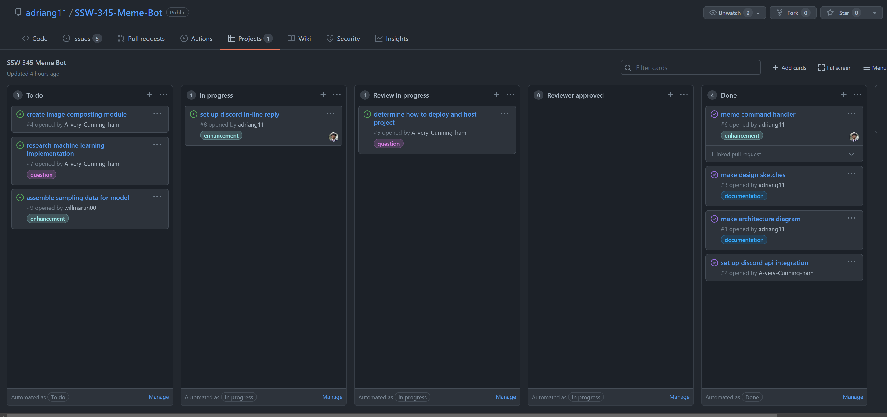

# Development Documentation

## Development process overview

Story creation was completed at a sprint planning meeting held by the entire team. During this meeting the tasks to develop were laid out, a round of planning poker was played to assign complexity on a scale of 1 - 10, and a developer was assigned to each task. This process allowed the whole team to stay in sync and work efficiently to complete the required tasks. Coding related tasks were logged using Github issues while other tasks were managed by assignees directly. A discord server was used to help team members stay in contact and to facilitate standup and impromptu meetings.

## Sprint 1 Tasks

| Task                           | Complexity | Developer        |
| ------------------------------ | ---------- | ---------------- |
| Make architecture diagram      | 2          | Avery            |
| Set up discord api integration | 3          | Adrian           |
| Make design sketches           | 3          | Jordan / team    |
| Meme command handler           | 5          | William / Adrian |
| Host project with Heroku       | 5          | Adrian           |

### Sprint 1 Scrum Notes

Kickoff Scrum!

- Created a kanban board for our repo and added some columns
- Talked about initial issues/project timeline

End-of-Week Scrum

- Design and architecure sketches finished
- Rest of work going smoothly

Final Scrum Notes

- Command handler/boilerplate completed
- Heroku hosting is online! From now on, directly test the bot in discord.

### Sprint 1 Reflection

At the end of this sprint all of the above tasks were successfully completed by the assigned developers.

## Sprint 2 Tasks

| Task                                    | Complexity | Developer        |
| --------------------------------------- | ---------- | ---------------- |
| Compose text on images                  | 5          | William          |
| Command parsing fixes                   | 2          | William / Jordan |
| Complete process documentation          | 2          | Avery            |
| Image programmatic coordinate breakdown | 5          | Adrian / Jordan  |

### Sprint 2 Scrum Notes

Kickoff Scrum!

- Played planning poker. Had some disagreement on text composition, but settled it on 5 (over 3).

End-of-Week Scrum

- Parsing is having some continued issues, setting Will/Jordan to solve. (Decided on two story points.)
- Machine learning is proving troublesome. For now, work continues on creating viable meme formats to be edited.

Final Scrum Notes

- Parsing issue was solved
- Image composition completed!
- Meme formats completed! Need further work/refinement due to mistakes when loading in image editors, but this shouldn't be too difficult
- Performed last merge wave to get the entire project together.

### Sprint 2 Reflection

At the end of this sprint, most basic tasks involving image processing (or "meme creation" were completed). We hoped to achieve more in terms of making more consistent memes (say, text placement) but time caught up with us. Likewise, we didn't have much time to prepare the machine-learning backend to go with our frontend work. This will be an important subject in our future work on this bot, and it is now our top priority before this project's final submission.
