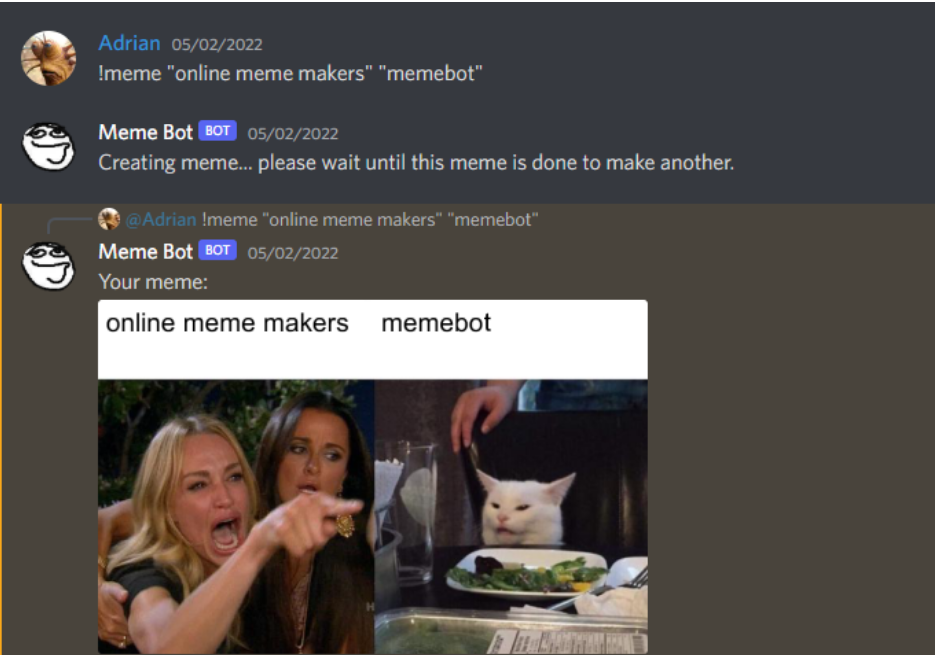
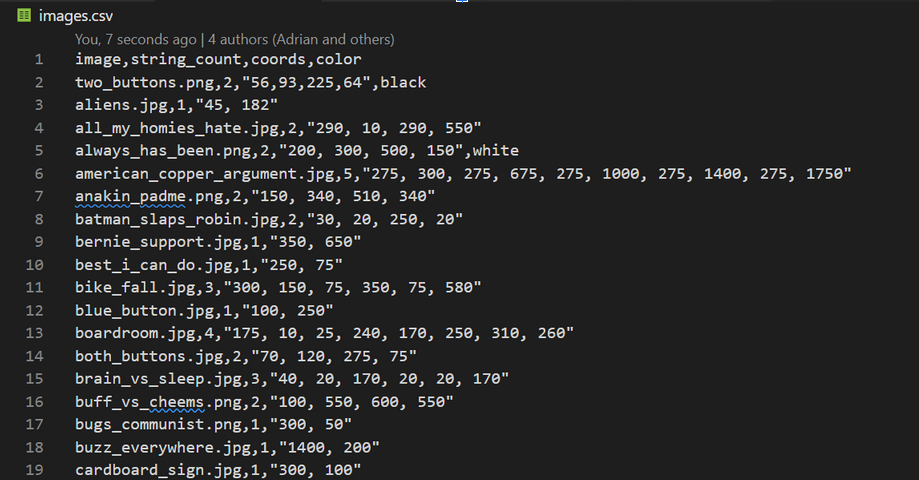
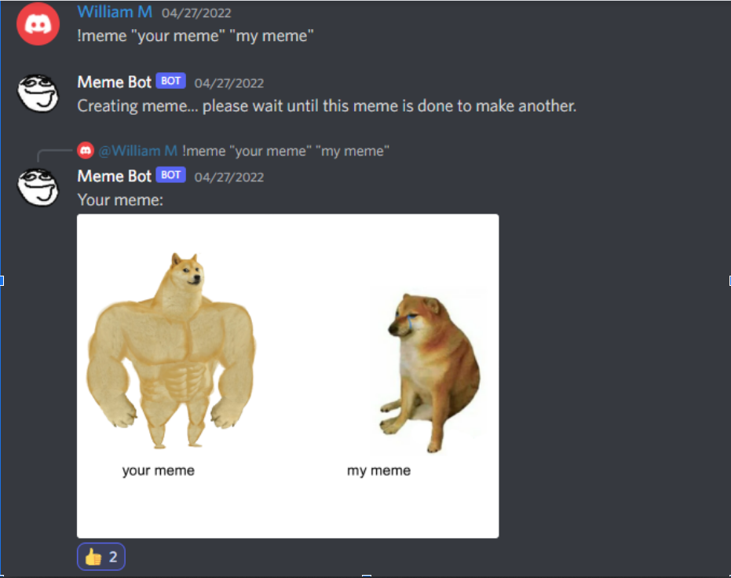

# SSW 345 Final Report

Avery Cunningham, Adrian Garcia, Jordan Fernandes, WIlliam Martin

[Final report promotional video](https://www.youtube.com/watch?v=IcyuOZetB1I)

## Problems Solved

As mentioned in our initial design document, the main problem we were trying to solve was the ease of quickly making memes and sharing them on Discord. In the end, we were able to achieve this goal, to a fair extent. Now, to make a meme, instead of hauling through an online meme generator, all users need to do is call on the meme-bot with “!meme” and text, and a meme is quickly generated and returned.

As it stands now, the bot generates random memes from a set of templates, meaning that meme creation is quick, but not super-customized yet. This is both a benefit and a drawback: the randomosity factor adds some charisma to the bot that could make it even more popular on servers. However, for custom memes, meme generators are still superior.

## Primary features

In terms of features, our bot is rather simple, with only one main command. If a user inputs “!meme” in Discord, followed by text strings in quotes, the bot will take in the text inputs, edit a selected meme format to include the text, and output it.

A lot of the magic of this bot is in our storage method. The bot contains all of its meme formats in a local folder, and this folder is indexed with images.csv. This directory folder contains information on each image, including how many text slots there are, where the slots are, and if text needs to be output in white instead of black. The bot uses this index when choosing an image: it will make sure to only select a meme with enough text slots for the inputs. Thus, the bot has some agency in how it makes its selections, although the rest is random.

## Reflection

In retrospect, we believe our bot definitely serves the purpose we designed it for. Our initial goals were lofty but it did not prevent us from changing our strategy during development to focus on the most important aspects of meme generation. The biggest aspect of our goal that forced us to lower the scope of our project was the implementation of machine learning to intelligently select from the database of meme templates for a given input. There were many challenges associated with this task, one being the sheer amount of data needed to train the AI model in order for the feature to be well-received. Given the fact that our bot was only hosted on our group’s server, the training process would certainly take much longer than the timespan of this course. Regardless, we feel fulfilled in that we were at least able to design a framework to allow for this feature in the future, should we continue with this project.

Likewise, we found the agile development process to be extremely useful in keeping us on the right track, allowing sufficient time for development, review, testing, and reconsiderations. Our planning meetings and Github structure were instrumental to keeping this project on track, and we plan to keep these techniques in the future. Overall, we consider this project to be a success. Not only are we proud of the current working model but we have all learned a great deal from this course, using concepts such as architecture styles, design patterns, CI/CD, software testing and more in practical applications.

## Limitations and Discussion

While our project currently works successfully as a proof of concept it still has several limitations which we were unable to fix before the due date. Firstly, there are a few issues with how text is rendered to an image when creating a meme. An issue with the Jimp library prevented us from using a proper font with stroke on our images, something that would make our finished memes look more professional. We also ran into issues with scaling and wrapping text due to the way we defined the text locations as single points instead of a bounding box. The implementation of the bot also needs some improvements to allow for concurrent meme generation. These limitations do not prevent the project from being a success but instead provide us with the opportunity to make the project even better in the future
We also look forward to improving the bot further with some features that we explored but didn’t have time to fully implement. For example, our idea to train a neural network based on user reactions to generated images is close to being finished and is something we hope to complete after finals are over. Overall, we had a great time working on this project and hope to continue its development into a production-ready application.
